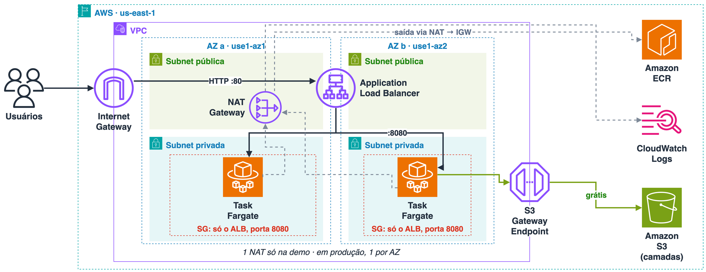

# ufpa-api

**Da imagem Docker ao deploy seguro no ECS Fargate**, de ponta a ponta e com cada decisão explicada.

Uma API mínima em Go, empacotada numa imagem de poucos MB, rodando no ECS Fargate (ARM64) atrás de um load balancer. Cada resposta diz **qual container atendeu** e **em qual zona de disponibilidade**, e com isso dá para *ver* a nuvem trabalhando:

- o load balancer alternando entre containers em AZs diferentes;
- um deploy trocando `v1` por `v2` sem nenhuma requisição falhar;
- a AWS subindo sozinha um container novo quando você mata um.

```
GET /v1/info  → {"app":"ufpa-api","version":"v1","task_id":"a1b2c3","az":"us-east-1a"}
GET /healthz  → {"status":"ok"}
```

## Sumário

- [O que você aprende aqui](#o-que-você-aprende-aqui)
- [Arquitetura](#arquitetura)
- [Imagem ingênua vs. imagem bem feita](#imagem-ingênua-vs-imagem-bem-feita)
- [Rodando](#rodando)
- [Experimentos](#experimentos)
- [Segurança: o que cada decisão protege](#segurança-o-que-cada-decisão-protege)
- [Custo e limpeza](#custo-e-limpeza)
- [Indo para produção](#indo-para-produção)
- [Estrutura do repositório](#estrutura-do-repositório)

## O que você aprende aqui

1. **Construir uma boa imagem:** multi-stage, distroless, usuário não-root, digest fixo e scan de vulnerabilidades.
2. **Como o ECS roda seu container:** task definition, service, load balancer, health check, rolling deploy e self-healing.
3. **Task role vs. execution role**, a dúvida clássica de prova e de incidente:
   - **Execution role:** usada pela **AWS** para preparar o container (baixar a imagem do ECR, mandar logs para o CloudWatch).
   - **Task role:** usada pelo **seu código** quando ele chama APIs da AWS. Aqui ela fica vazia, porque a app não chama nenhuma.

## Arquitetura



- **Linha sólida:** o caminho da requisição. Internet Gateway → ALB → tasks na porta 8080; o security group das tasks só aceita o ALB.
- **Linha tracejada:** a saída das tasks pelo NAT Gateway para baixar a imagem (ECR) e enviar logs (CloudWatch).
- **Linha verde:** as camadas da imagem vêm do S3 pelo Gateway Endpoint, de graça e sem passar pelo NAT.

O diagrama foi feito no [draw.io](https://www.drawio.com/) com os ícones oficiais da AWS. A fonte editável é [`assets/arquitetura.drawio`](assets/arquitetura.drawio).

Toda a infraestrutura está em um único template CloudFormation: [`infra/stack.yaml`](infra/stack.yaml).

| Decisão | Por quê |
|---|---|
| Containers em subnets privadas | Ninguém na internet fala direto com eles, só o load balancer |
| Um único NAT Gateway | Economia de demo. Em produção, use um por AZ |
| S3 Gateway Endpoint | As camadas da imagem vêm do S3 sem passar pelo NAT (que cobra por GB) |
| Fargate ARM64 (Graviton) | Mais barato que x86 e sem servidor para administrar |
| Deploy via CloudFormation | Toda mudança, inclusive de versão, fica versionada no Git |

## Imagem ingênua vs. imagem bem feita

Mesmo código, dois Dockerfiles:

| | [`Dockerfile.naive`](Dockerfile.naive) | [`Dockerfile`](Dockerfile) |
|---|---|---|
| Base | `golang:1.27` (Debian + compilador) | `distroless/static:nonroot` |
| Tamanho (`docker images`) | **1,44 GB** | **16,8 MB** (3,7 MB comprimida no ECR) |
| CVEs HIGH/CRITICAL (Trivy) | **194** | **0** |
| Shell dentro do container | Sim | Não |
| Roda como root | Sim | Não (UID 65532) |
| Imagem base | Tag mutável | Fixada por digest, atualizada pelo Dependabot |

O compilador não vai para produção: ele fica no primeiro estágio do build, e só o binário segue para a imagem final.

## Rodando

### Pré-requisitos

- Docker com buildx
- [Trivy](https://trivy.dev/) para o scan de vulnerabilidades
- Go 1.27+ (só para rodar os testes)
- Para a parte na AWS: AWS CLI v2 com credenciais temporárias (`aws login` ou `aws sso login --profile <perfil>`, depois `export AWS_PROFILE=<perfil>`)

### Só local, sem AWS

```bash
make test                                     # testes da API
make build-naive && make build && make compare
make scan-warmup && make scan                 # CVEs das duas imagens
make build PLATFORM=linux/amd64 && make run-local   # em máquina x86; em Mac M1+ basta make build
curl localhost:8080/v1/info
```

### Na AWS (região `us-east-1`)

> [!WARNING]
> Isso cria recursos pagos (cerca de US$ 0,10/h). Rode `make destroy` quando terminar.

```bash
make bootstrap                 # cria a infra sem containers (~4 min; o repositório ECR ainda está vazio)
make release VERSION=v1        # build ARM64 → push para o ECR → sobe 2 tasks (~2,5 min)
make watch                     # curl em loop no load balancer (Ctrl+C para parar)
```

O deploy é feito em duas fases porque o ECS não consegue subir um container cuja imagem ainda não existe no ECR.

As subnets usam os IDs de zona `use1-az1` e `use1-az2`, e não nomes como `us-east-1a`, porque cada conta mapeia os nomes para zonas diferentes e o Fargate ARM64 não roda na `use1-az3`. Para trocar: `--parameter-overrides AvailabilityZoneIds=use1-az4,use1-az6`.

## Experimentos

Com a stack no ar, deixe o `make watch` rodando em um terminal e use outro para os comandos:

| Experimento | Comando | O que observar |
|---|---|---|
| Tamanho da imagem | `make build-naive && make build && make compare` | 1,44 GB contra 16,8 MB |
| Vulnerabilidades | `make scan-warmup && make scan` | 194 CVEs HIGH/CRITICAL contra 0 |
| Load balancing | `make watch` | `task_id` e `az` alternando |
| Rolling deploy | `make build VERSION=v2 && make push VERSION=v2`, depois `make deploy VERSION=v2` | `v1` vira `v2` sem nenhuma resposta falhar (~4 min) |
| Self-healing | `make kill-task` | Um `task_id` novo aparece em ~1 min, sem nenhuma resposta falhar |
| Logs | `make logs` | Logs JSON no CloudWatch |

Os números foram medidos numa conta de testes em `us-east-1`. Alguns detalhes que ajudam a entender o que aparece na tela:

- **Deploy demorado:** o `make deploy` só termina quando o CloudFormation confirma que o service estabilizou.
- **Self-healing sem erro:** o ECS tira o task parado do load balancer e espera as conexões drenarem antes de encerrá-lo. Por isso o `watch` não mostra falha, só um `task_id` sumindo e outro aparecendo.
- **`make logs` vazio:** ele mostra só os últimos 10 minutos e os health checks não são logados. Gere tráfego com o `watch` antes.
- **Scan no console do ECR:** a tag `v1` aponta para um índice multi-arquitetura. O resultado do scan fica na imagem arm64, na linha sem tag.

## Segurança: o que cada decisão protege

| Camada | Como está | Por quê |
|---|---|---|
| Imagem | Distroless, sem shell, usuário não-root | Menos pacotes = menos CVEs; quem invadir não tem shell nem root |
| Runtime | Filesystem somente leitura e todas as Linux capabilities removidas | O processo não consegue alterar o próprio container |
| Rede | Security group dos tasks aceita só o security group do ALB | Nada chega aos containers sem passar pelo load balancer |
| Execution role | Pull só deste repositório, escrita só neste log group | Menor privilégio para a AWS |
| Task role | Vazia, com condição contra *confused deputy* | Se a app for comprometida, não ganha acesso à conta |
| ECR | Tags imutáveis, scan on push, mantém as últimas 10 imagens | `v1` é sempre a mesma imagem e toda versão é rastreável |
| Deploy | Rolling 100/200 com circuit breaker e rollback automático | Uma versão quebrada volta sozinha para a anterior |
| Shutdown | App encerra em 8 s, antes dos 10 s em que o ECS mata o processo | Requisições em andamento terminam antes do container sair |
| Keep-alive | App 65 s, mais que o idle de 60 s do ALB | Evita 502 em conexões reaproveitadas |

O template passa no [Checkov](https://www.checkov.io/) com 35 checks aprovados. As 7 exceções estão justificadas no próprio template:

<details>
<summary>Exceções aceitas do Checkov</summary>

| Check | Motivo |
|---|---|
| CKV_AWS_260, CKV_AWS_2, CKV_AWS_103 | ALB público na porta 80; vira redirect para HTTPS com `CERT_ARN` |
| CKV_AWS_91 | Access logs do ALB criariam um bucket sem uso numa demo curta |
| CKV_AWS_136, CKV_AWS_158 | KMS CMK no ECR e nos logs adiciona custo sem dado sensível |
| CKV_AWS_65 | Container Insights é cobrado por métrica; ALB e logs bastam |

</details>

### HTTPS (opcional)

```bash
make deploy CERT_ARN=arn:aws:acm:us-east-1:<conta>:certificate/<id>
```

A porta 80 passa a redirecionar para a 443 (TLS 1.3/1.2). Crie um CNAME do seu domínio apontando para o DNS do ALB, porque o certificado não cobre `*.elb.amazonaws.com`.

## Custo e limpeza

Cerca de **US$ 0,10/h** em `us-east-1`. O maior item é o NAT Gateway, seguido do ALB, dos 2 tasks Fargate ARM (0.25 vCPU / 0.5 GB) e dos IPv4 públicos. NAT e ALB cobram por hora cheia: na validação, 25 minutos de stack custaram ~US$ 0,08. Confira na [AWS Pricing Calculator](https://calculator.aws/) antes de subir.

```bash
make destroy
```

Remove tudo, inclusive o repositório ECR com as imagens dentro (`EmptyOnDelete`).

## Indo para produção

Esta é uma demo. Para produção, reavalie:

- um NAT Gateway por AZ, ou VPC interface endpoints para ECR e CloudWatch Logs;
- HTTPS obrigatório e AWS WAF no ALB;
- KMS nas imagens e nos logs, e access logs do ALB;
- pipeline de CI/CD com SBOM e assinatura de imagem (cosign);
- deploy blue/green e Container Insights.

## Estrutura do repositório

```
.
├── main.go                  # servidor HTTP e graceful shutdown
├── handler.go               # rotas /v1/info e /healthz
├── metadata.go              # lê task_id e AZ do metadata endpoint do ECS
├── *_test.go                # testes
├── Dockerfile               # multi-stage + distroless (o jeito certo)
├── Dockerfile.naive         # o jeito ingênuo, para comparar
├── infra/stack.yaml         # toda a infra em CloudFormation
├── .github/dependabot.yml   # atualiza os digests das imagens base
├── assets/                 # diagrama de arquitetura (PNG + fonte .drawio)
├── Makefile                 # todos os comandos
└── LICENSE
```

## Licença

[MIT](LICENSE)
